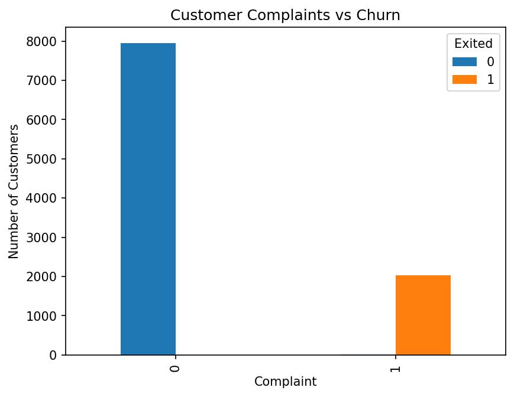
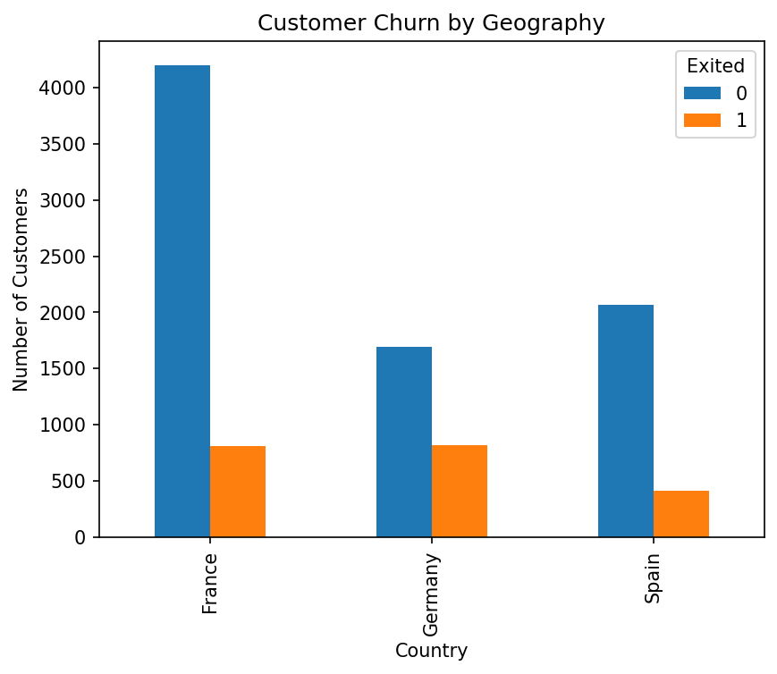
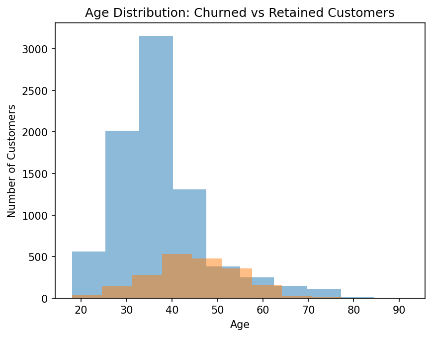
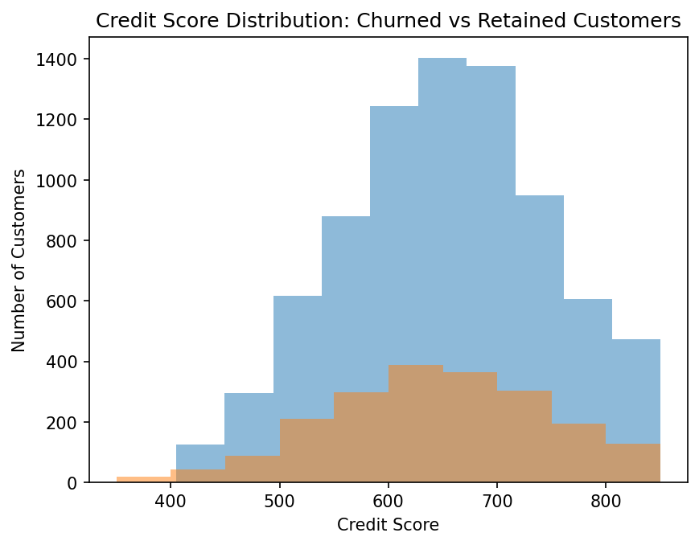
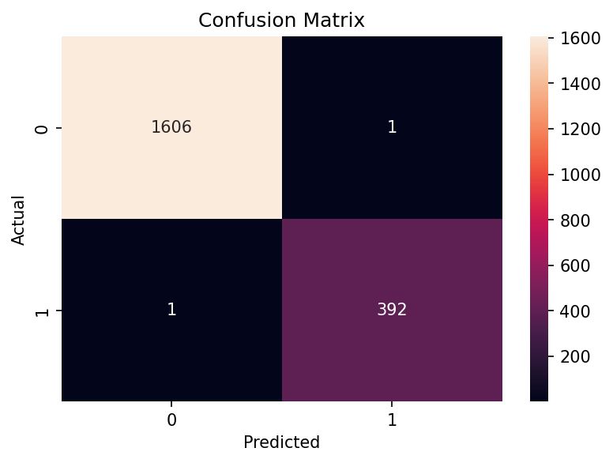
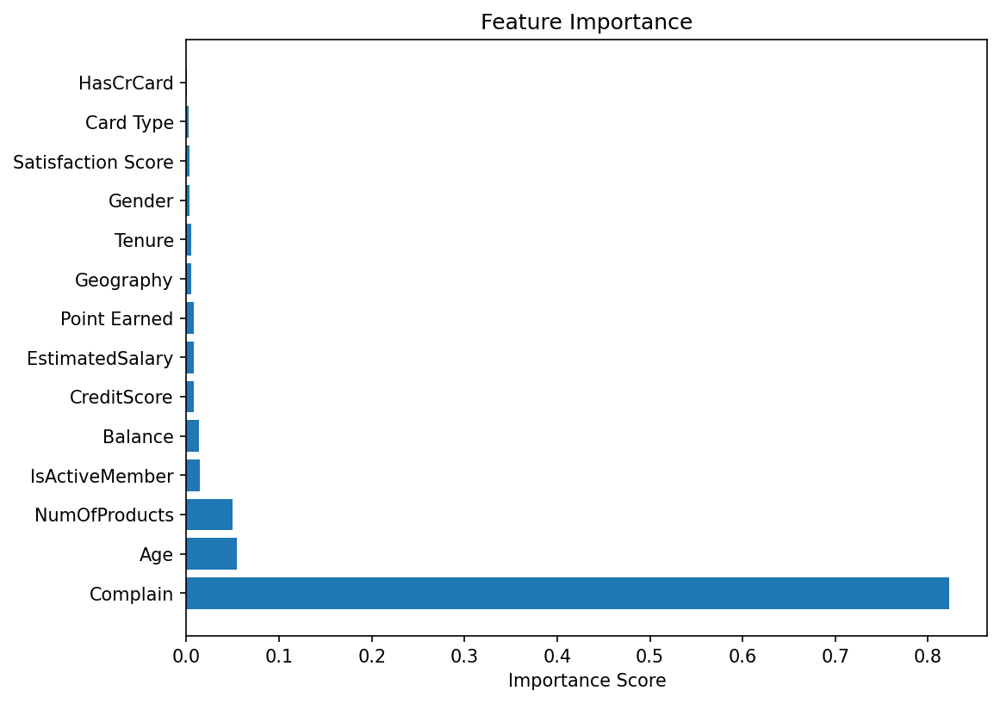
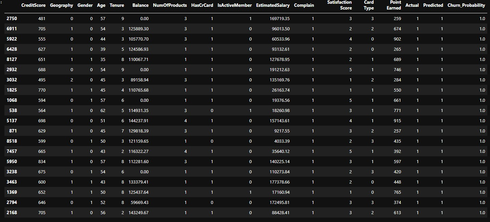

# Customer Churn Prediction using Machine Learning and Power BI

     Project Overview

This project aims to predict customer churn in a banking environment using Machine Learning and visualize business insights through Power BI
Customer churn refers to customers who leave the bank and stop using its services. Predicting churn allows organizations to proactively retain customers and improve customer satisfaction.

     Business Problem

Customer retention is one of the most important challenges faced by banks

The objective of this project is to:

- Identify customers likely to leave the bank
- Understand the factors influencing churn
- Build a predictive machine learning model
- Create an interactive Power BI dashboard for business decision-making
 --- 
     Dataset

The dataset contains information about 10,000 bank customers.

| Feature            | Description                               |
| ------------------ | ----------------------------------------- |
| CreditScore        | Customer credit score                     |
| Geography          | Customer country                          |
| Gender             | Customer gender                           |
| Age                | Customer age                              |
| Tenure             | Years with the bank                       |
| Balance            | Account balance                           |
| NumOfProducts      | Number of bank products                   |
| HasCrCard          | Credit card ownership                     |
| IsActiveMember     | Customer activity status                  |
| EstimatedSalary    | Estimated annual salary                   |
| Complain           | Complaint status                          |
| Satisfaction Score | Customer satisfaction level               |
| Card Type          | Credit card category                      |
| Point Earned       | Loyalty points earned                     |
| Exited             | Target variable (0 = Stayed, 1 = Churned) |

---
    Data Cleaning

The following data preparation steps were performed:

- Checked for missing values
- Checked for duplicate records
Removed non-predictive columns:

  - RowNumber
  - Customer
  - Surname

The dataset contained no missing values and no duplicate records

     Exploratory Data Analysis

Several visual analyses were conducted to understand customer behavior

**Key Findings:**

# Customer complaints were strongly associated with churn

# Geography influenced customer retention

  
# Age appeared to be an important churn factor
  
   

# Satisfaction levels impacted customer behavior

     Machine Learning
**Data Preprocessing**

Categorical variables were encoded:

- Geography
- Gender
- Card Type
  
**Model Used**

Random Forest Classifier

Workflow

1- Feature Selection
2- Train-Test Split (80/20)
3- Model Training
4- Prediction
5- Model Evaluation

   Model Evaluation

**Accuracy Score**

Accuracy:  0.999

The model demonstrated strong predictive performance in identifying customers likely to churn

**Confusion Matrix**

  **Feature Importance**

The Random Forest model identified the most influential factors contributing to customer churn

Examples of important features include:

- Complaint Status
- Age
- Customer Activity Status
- Balance
- Number of Products

     High-Risk Customer Analysis

The model generated churn probabilities for individual customers

Key observations:

- Customers with complaints showed significantly higher churn risk
- Inactive customers were more likely to leave
- Older customers appeared more vulnerable to churn
- Long tenure alone did not guarantee customer retention

  

These insights can support proactive customer retention strategies

    Power BI Dashboard

The Power BI dashboard was developed to present findings to business stakeholders.

**Dashboard Pages**

Executive Summary

- Total Customers
- Churn Rate
- Predicted Churn Customers
- Average Churn Probability
  
Churn Drivers

- Geography Analysis
- Gender Analysis
- Complaint Analysis
- Age Analysis
- Feature Importance

High-Risk Customers

- Customer Risk Table
- Churn Probability Monitoring
- Interactive Filters

    Technologies Used
    
- Python
- Pandas
- NumPy
- Matplotlib
- Seaborn
- Scikit-Learn
- Power BI
 ---
    Business Recommendations

Based on the analysis, the following actions are recommended:

Improve complaint resolution processes
Increase engagement of inactive customers
Develop targeted retention campaigns for high-risk customers
Monitor customer satisfaction regularly
Use churn probability scores to prioritize retention efforts

    Conclusion

This project successfully combined Machine Learning and Power BI to predict customer churn and provide actionable business insights. The solution enables data-driven decision-making and helps banks reduce customer attrition through proactive retention strategies.
